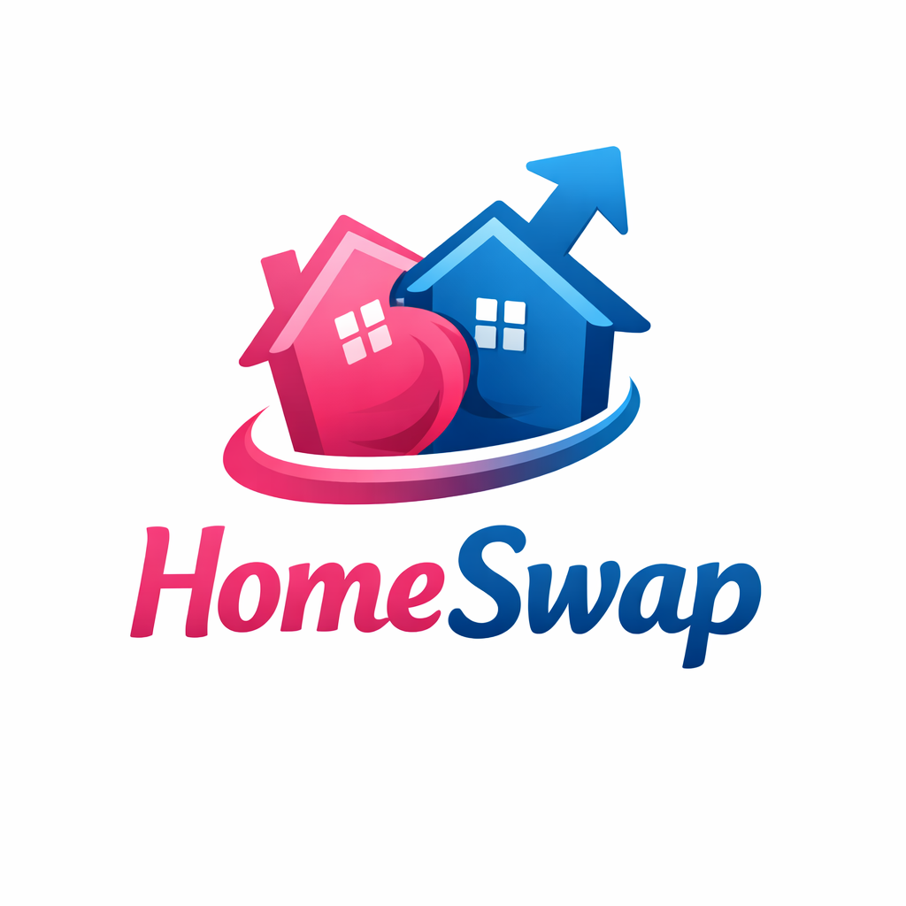
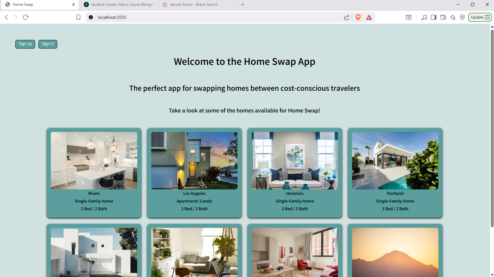
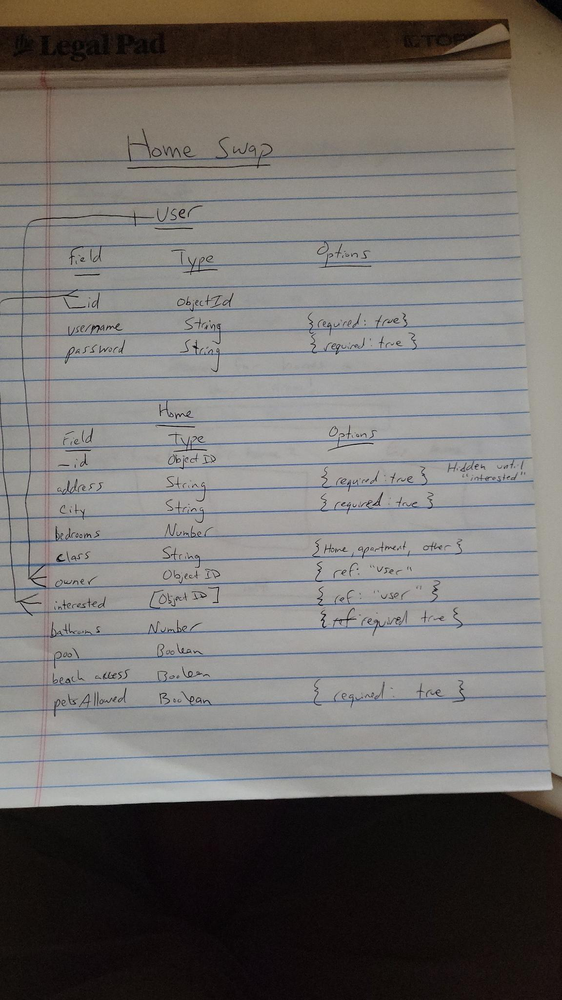

Link to the application: [Home Swap Application](https://home-swap-u9ea.onrender.com/)

# Home Swap

The perfect app for swapping homes between cost-conscious travelers.

**Description**

* Home Swap is an application where users can create a Home that they would be willing to *home swap* with another user. Home swapping is when two users decide that they would like to trade homes for a specific amount of time.

* Users can decide to swap for as long as they would like as the reasons for home-swapping can vary. Examples for home swapping can include vacation, temporary re-location without having to sell or buy a home, or any multitude of reasons.

* To use the Home Swap application, users will create an account and then enter their home information. Once a home has been uploaded, users can browse available homes and decide if they would like to ***swap right*** on another user's property. Only when another user ***swaps right*** on one of the current user's homes will contact information be available for the homeowners to contact each other to set up the dates and details of a Home Swap.

* Home Swap does not take any legal responsibility besides connecting like-minded home owners that are willing to swap homes.

* Think Tinder, but for homes.

# Background Info

* I chose to create this application primarily for the reason that my wife had this idea years ago and I thought it would be fun to turn her idea into reality.

# Technologies Used

* JavaScript, HTML, CSS, VS Code, EJS, Node.js, Express.js, Mongoose, MongoDB. Also, credit to OpenAI for generating the racy Home Swap logo and helping me debug some roadblocks during the coding process.

# Attributions

* Tinder and other dating applications that use a similar matching algorithm were a big inspiration.

# Next Steps/ Stretch Goals

* The next steps for the application would be to better organize the user's profile page and include a section for homes that have swapped right on the user's home and are awaiting an action from the user before creating a *swap match*. Also, instead of only sharing the contact information between users, I would like to show the property information that was specifically *swapped right* on. Lastly, adding a home's availability would greatly improve the chances of an actual home swap occurring once a match has been made.